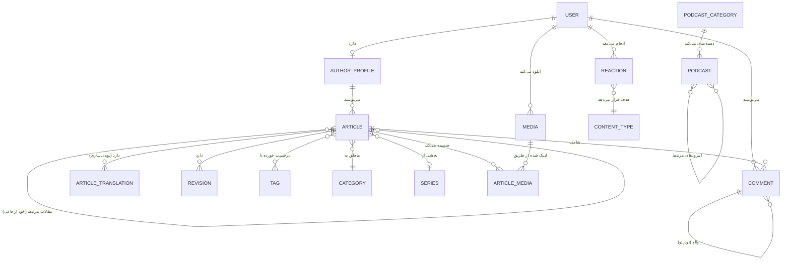
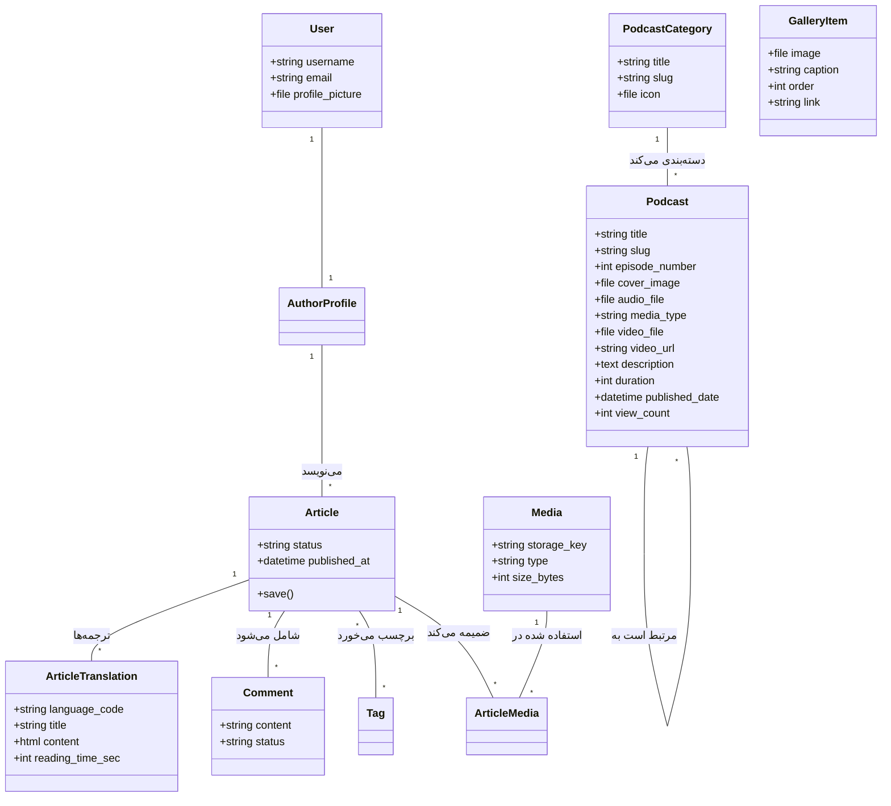
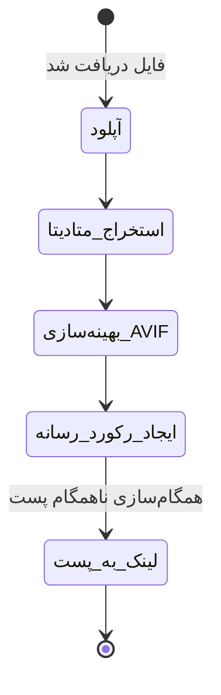
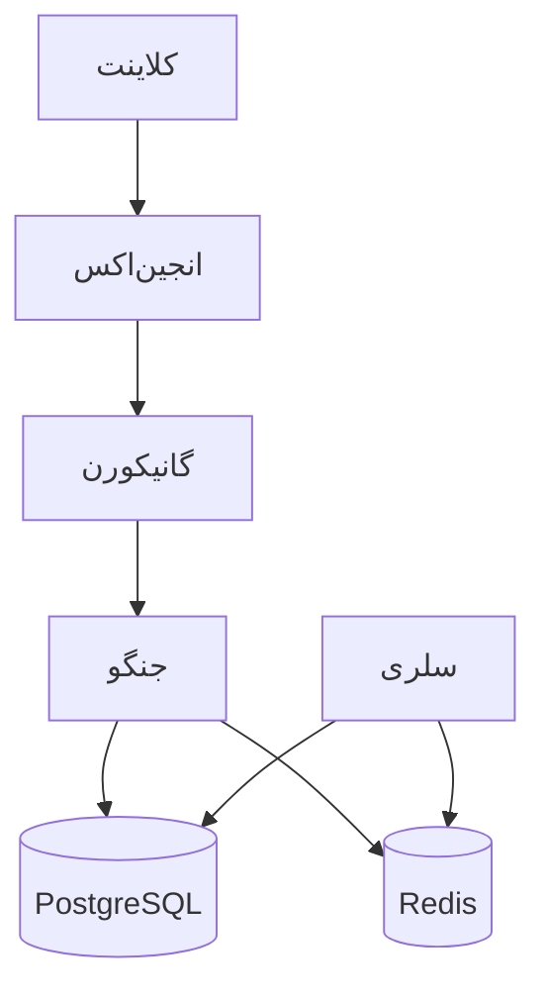

# مستندات جامع معماری بک‌اِند و پایگاه داده

**نام پروژه:** پلتفرم بلاگ (Blog Platform)
**نسخه:** 1.0.0
**تاریخ:** ۱۴ ژوئن ۲۰۲۴
**وضعیت:** آماده بهره‌برداری (Production-Grade)
**مخاطبان:** مدیران فنی (CTOs)، توسعه‌دهندگان ارشد، اعضای جدید تیم، حسابرسان و ذینفعان فنی

---

# بخش ۱ — نمای کلی سیستم

## هدف پروژه
**پلتفرم بلاگ** یک سیستم مدیریت محتوای (CMS) در سطح سازمانی است که برای جریان‌های کاری انتشار با کارایی بالا طراحی شده است. این سیستم با ارائه یک بک‌اِند مقیاس‌پذیر، امن و ماژولار، نیازهای پورتال‌های خبری مدرن و وبلاگ‌ها را برآورده می‌کند.

## حوزه کسب‌و‌کار (Business Domain)
سیستم در حوزه **نشر دیجیتال و مدیریت محتوا** فعالیت می‌کند. این پلتفرم چرخه‌های پیچیده حیات محتوا، مدیریت رسانه‌های غنی با بهینه‌سازی‌های خودکار و تعاملات کاربران از طریق تعاملات اجتماعی (نظرات و واکنش‌ها) را مدیریت می‌کند.

## ویژگی‌های اصلی
*   **مدیریت هویت:** احراز هویت مبتنی بر Static API Key، توکن‌های JWT و کنترل دسترسی مبتنی بر نقش (RBAC).
*   **موتور انتشار:** چرخه حیات پیشرفته پست (پیش‌نویس، بررسی، زمان‌بندی شده، منتشر شده)، بومی‌سازی محتوا (Multi-language)، ویرایش متن غنی با CKEditor 5 و زمان‌بندی خودکار از طریق Celery.
*   **کتابخانه رسانه:** ثبت مرکزی رسانه‌ها و مدیریت انواع فایل‌های صوتی، تصویری و ویدیویی.
*   **تعاملات:** نظرات رشته‌ای سلسله‌مراتبی و سیستم واکنش عمومی (لایک/ایموجی) قابل اعمال بر روی هر نوع محتوا.
*   **سئو و اجتماعی:** تولید خودکار سایت‌مپ (Sitemap)، پشتیبانی از تاریخ شمسی (Jalali)، مدیریت متادیتای سئو و یکپارچگی با OpenGraph.

## سبک معماری
سیستم از معماری **مونو‌لیت ماژولار** (Modular Monolith) پیروی می‌کند. در حالی که به صورت یک واحد یکپارچه مستقر می‌شود، مرزهای دامنه دقیق بین اپلیکیشن‌ها را حفظ می‌کند که آن را برای تبدیل به ریزسرویس (Microservice-ready) آماده می‌سازد. این سیستم از رویکرد لایه‌ای استفاده می‌کند:
1.  **لایه API (DRF):** رسیدگی به درخواست‌ها، سریال‌سازی و پاسخ‌های استاندارد شده.
2.  **لایه سرویس (Service Layer):** کپسوله‌سازی منطق کسب‌و‌کار و اطمینان از جدایی آن از Viewها.
3.  **لایه داده (ORM):** مدیریت تعاملات با PostgreSQL و یکپارچگی داده‌ها.
4.  **لایه ناهمگام (Async Layer - Celery):** پردازش‌های پس‌زمینه (رسانه، اعلان‌ها، زمان‌بندی).

## پشته تکنولوژی (Technology Stack)
| بخش | تکنولوژی |
| :--- | :--- |
| **فریم‌ورک بک‌اِند** | Django 5.0.6 (Python 3.12) |
| **فریم‌ورک API** | Django REST Framework (DRF) |
| **پایگاه داده اصلی** | PostgreSQL 14 |
| **کش و واسط پیام** | Redis 7.2 |
| **صف وظایف** | Celery |
| **زمان‌واقعی** | Django Channels (ASGI) |
| **وب سرور** | Gunicorn |
| **پراکسی معکوس** | Nginx |
| **کانتینرسازی** | Docker & Docker Compose |

---

# بخش ۲ — تفکیک اپلیکیشن‌ها

## ۱. اپلیکیشن `users`
**مسئولیت:** مدیریت هویت و احراز هویت.
**هدف کسب‌و‌کار:** مدیریت حساب‌های کاربری، جریان‌های احراز هویت (JWT/Static API Key) و کنترل‌های دسترسی.

### ساختار داخلی:
*   **models.py:**
    *   `User`: مدل سفارشی که `AbstractUser` را گسترش می‌دهد. فیلد `profile_picture` را با بهینه‌سازی خودکار اضافه می‌کند.
*   **serializers.py:**
    *   `CustomTokenObtainPairSerializer`: منطق سفارشی JWT.
    *   `UserSerializer`: مدیریت کامل پروفایل کاربری برای مالکان.
    *   `UserCreateSerializer`: مدیریت ثبت‌نام و اعتبارسنجی رمز عبور.
    *   `UserReadOnlySerializer`: نمایش پروفایل عمومی.
*   **views.py:**
    *   `UserViewSet`: عملیات CRUD با مجوزها و سریال‌سازهای پویا.
    *   `CustomTokenObtainPairView`: نقطه پایانی ورود مدیریتی.
*   **permissions.py:**
    *   `IsAdminUser`: محدود به کارکنان.
    *   `IsOwnerOrAdmin`: محدود به مالک شیء یا کارکنان.
*   **auth_utils.py:**
    *   `should_never_lockout_staff`: فراخوان سفارشی برای Axes جهت جلوگیری از قفل شدن ادمین.
*   **signals.py:**
    *   `user_post_save` / `user_post_delete`: باطل کردن ورودی‌های کش داشبورد کاربر.
*   **urls.py:** تعریف مسیرها برای `users/` و `auth/admin-login/`.
*   **admin.py:** مدیریت کاربر بهبود یافته با استفاده از `Unfold` ، شامل `SimpleHistory` و `Select2`.

---

## ۲. اپلیکیشن `articles`
**مسئولیت:** موتور محتوا و تاکسونومی‌ها.
**هدف کسب‌و‌کار:** منطق اصلی انتشار و سازماندهی محتوا با پشتیبانی از چندزبانی.

### ساختار داخلی:
*   **models.py:**
    *   `Article`: مدل مرکزی مدیریت وضعیت و روابط. از `ArticleManager` استفاده می‌کند.
    *   `ArticleTranslation`: ذخیره محتوای بومی‌سازی شده (عنوان، متن، سئو) برای هر زبان.
    *   `AuthorProfile`: متصل به User، بیوگرافی و نام نمایشی را ذخیره می‌کند.
    *   `Category`: تاکسونومی‌های سلسله‌مراتبی.
    *   `Tag`: برچسب‌های ساده.
    *   `Series`: گروه‌بندی پست‌های مرتبط.
    *   `Revision`: نسخه‌های تاریخی محتوا (به تفکیک زبان).
    *   `ArticleTag`: رابط برای رابطه چند‌به‌چند.
    *   `PodcastCategory`: دسته‌بندی موضوعی اپیزودهای پادکست.
    *   `Podcast`: اپیزودهای چندرسانه‌ای صوتی/ویدیویی (ویدیوکست).
    *   `GalleryItem`: آیتم تصویر گالری با استایل پولاروید، کپشن و لینک اختیاری.
*   **serializers.py:**
    *   `ArticleListSerializer` / `ArticleDetailSerializer`: بهینه‌سازی شده برای نمایش محتوای بومی‌سازی شده.
    *   `ArticleCreateUpdateSerializer`: مدیریت منطق پیچیده انتشار و ترجمه‌ها.
    *   `ContentNormalizationMixin`: تبدیل HTML به Markdown تمیز برای نمایش‌ها.
    *   `JalaliDateTimeField`: نمایش سفارشی تاریخ شمسی.
    *   `PodcastCategorySerializer` / `PodcastSerializer`: مدیریت دسته‌بندی و نمایش پادکست‌ها.
    *   `GalleryItemSerializer`: مدیریت نمایش گالری تصاویر پولاروید.
*   **views.py:**
    *   `ArticleViewSet`: فیلترینگ پیشرفته بر اساس زبان، انتخاب فیلد پویا و منطق تشابه.
    *   `ArticleCommentViewSet`: نمایش تودرتو برای نظرات خاص هر پست.
    *   `publish_post` / `related_posts`: Viewهای عملکردی تخصصی API.
    *   `PodcastCategoryViewSet` / `PodcastViewSet`: اندپوینت‌های پویا برای پادکست با فیلتر دسته‌بندی/رسانه و شمارش اتمیک بازدید.
    *   `GalleryItemViewSet`: اندپوینت پویا برای دریافت و مرتب‌سازی کارت‌های گالری پولاروید.
*   **services.py:**
    *   `sync_article_media`: همگام‌سازی تگ‌های `` در محتوای ترجمه‌ها با رابط `ArticleMedia`.
    *   `publish_scheduled_articles`: منطق کسب‌و‌کار برای انتشار پست‌های زمان‌بندی شده.
*   **tasks.py:**
    *   `publish_scheduled_articles_task`: وظیفه دوره‌ای Celery.
    *   `increment_article_view_count_task`: افزایش ناهمگام تعداد بازدید.
*   **filters.py:** `ArticleFilter` پیاده‌سازی معیارهای "پست‌های داغ" و محدوده‌های تاریخی.
*   **forms.py:** `ArticleAdminForm` یکپارچه شده با CKEditor 5.
*   **urls.py:** روت‌های تودرتو برای پست‌ها و نظرات.
*   **admin.py:** پنل مدیریت جامع با `ModelAdminJalaliMixin` و Inlineها برای ترجمه‌ها.

---

## ۳. اپلیکیشن `medias`
**Responsibility:** کتابخانه رسانه و بهینه‌سازی.
**Business Purpose:** مدیریت متمرکز دارایی‌ها و بهینه‌سازی عملکرد.

### ساختار داخلی:
*   **models.py:**
    *   `Media`: ذخیره متادیتا برای تصاویر، ویدیوها و فایل‌ها.
    *   `ArticleMedia`: مدل رابط برای ردیابی استفاده در پست‌ها (کاور، تصویر OG، داخل محتوا).
*   **serializers.py:**
    *   `MediaCreateSerializer`: مدیریت آپلود فایل و اجرای منطق سرویس.
    *   `MediaDetailSerializer`: نمایش کامل متادیتا.
*   **services.py:**
    *   `create_media_from_file`: مدیریت تبدیل به AVIF، تغییر اندازه و استخراج متادیتا.
*   **views.py:**
    *   `MediaViewSet`: CRUD برای کتابخانه رسانه.
    *   `download_media`: تحویل امن فایل.
*   **admin.py:** `MediaAdmin` با پیش‌نمایش تصاویر و لینک‌های دانلود.

---

## ۴. اپلیکیشن `interactions`
**Responsibility:** لایه تعاملات اجتماعی.
**Business Purpose:** ویژگی‌های تعاملی مانند نظرات رشته‌ای و واکنش‌های عمومی.

### ساختار داخلی:
*   **models.py:**
    *   `Comment`: پشتیبانی از تودرتویی نامحدود و وضعیت‌های مدیریت.
    *   `Reaction`: کلید خارجی عمومی (Generic Foreign Key) برای واکنش به هر شیء در سیستم.
*   **serializers.py:**
    *   `CommentSerializer`: مدیریت ایجاد نظرات رشته‌ای.
    *   `ReactionSerializer`: اعتبارسنجی اشیاء هدف و انواع واکنش‌ها.
*   **services.py:**
    *   `create_comment`: مدیریت منطق و فعال‌سازی اعلان‌ها.
    *   `toggle_reaction`: مدیریت اتمیک افزودن/حذف لایک‌ها/ایموجی‌ها.
*   **tasks.py:**
    *   `notify_author_on_new_comment`: (جایگاه) منطق اعلان ناهمگام.
*   **views.py:** ViewSetها برای نظرات و واکنش‌ها با قابلیت ویرایش فقط برای مالک.
*   **admin.py:** رابط مدیریت و تایید برای نظرات.

---

## ۵. اپلیکیشن‌های `navigation` و `pages`
**Responsibility:** محتوای ساختاری.
**Business Purpose:** منوهای سایت و صفحات اطلاعاتی ایستا.

### ساختار داخلی:
*   **models.py:**
    *   `Menu` / `MenuItem`: پشتیبانی از سلسله‌مراتب هدر/فوتر/سایدبار.
    *   `Page`: محتوای ایستا با مدیریت وضعیت.
*   **serializers.py:** ModelSerializerهای استاندارد.
*   **views.py:** ViewSetها با مجوز `IsAdminUserOrReadOnly`.

---

## ۶. اپلیکیشن‌های `common` و `core`
**Responsibility:** زیرساخت‌های پایه.

### ساختار داخلی:
*   **core/base_models.py:** `BaseModel` که فیلدهای حسابرسی (`created_at`, `updated_at`) را فراهم می‌کند.
*   **common/fields.py:** فیلدهای سفارشی برای مدیریت رسانه‌ها.
*   **common/renderers.py:** `StandardResponseRenderer` برای خروجی یکنواخت API.
*   **common/exceptions.py:** `custom_exception_handler` برای خطاهای JSON استاندارد شده.
*   **common/mixins.py:** `DynamicFieldsMixin` برای سریال‌سازی انتخابی فیلدها.
*   **common/authentication.py:** `StaticAPIKeyAuthentication` برای دسترسی‌های تستی و ابزارهای خارجی.

---

# بخش ۳ — مستندات کامل پایگاه داده

تمام مدل‌ها در سیستم (به جز مواردی که از پیش‌فرض‌های جنگو ارث‌بری می‌کنند) از `core.base_models.BaseModel` ارث‌بری می‌کنند.

## فیلدهای پایه مشترک (`BaseModel`)
| فیلد | نوع | قابلیت نال | پیش‌فرض | محدودیت‌ها | توضیحات |
| :--- | :--- | :--- | :--- | :--- | :--- |
| `is_active` | Boolean | خیر | True | - | پرچم غیرفعال‌سازی نرم. |
| `created_at` | DateTime | خیر | now() | - | حسابرسی: زمان ایجاد رکورد. |
| `updated_at` | DateTime | خیر | now() | - | حسابرسی: زمان آخرین به‌روزرسانی. |

---

## ۱. `users.User`
**هدف:** هویت اصلی کاربر.

| فیلد | نوع | قابلیت نال | پیش‌فرض | محدودیت‌ها | توضیحات |
| :--- | :--- | :--- | :--- | :--- | :--- |
| `username` | VarChar | خیر | - | یکتا | شناسه اصلی ورود. |
| `email` | Email | خیر | - | - | ایمیل تماس. |
| `profile_picture`| Image | بله | - | - | تصویر پروفایل بهینه‌سازی شده. |

---

## ۲. `posts.AuthorProfile`
**هدف:** شخصیت عمومی نویسنده.

| فیلد | نوع | قابلیت نال | پیش‌فرض | محدودیت‌ها | توضیحات |
| :--- | :--- | :--- | :--- | :--- | :--- |
| `user` | OneToOne | خیر | - | PK, FK | اتصال به مدل User. |
| `display_name` | VarChar | خیر | - | - | نام نمایش داده شده در پست‌ها. |
| `bio` | Text | بله | - | - | بیوگرافی نویسنده. |
| `avatar` | FK(Media)| بله | - | SET_NULL | آواتار پروفایل از کتابخانه رسانه. |

---

## ۳. `posts.Category`
**هدف:** طبقه‌بندی سلسله‌مراتبی.

| فیلد | نوع | قابلیت نال | پیش‌فرض | محدودیت‌ها | توضیحات |
| :--- | :--- | :--- | :--- | :--- | :--- |
| `slug` | Slug | خیر | - | یکتا | شناسه‌گر URL. |
| `name` | VarChar | خیر | - | - | نام دسته‌بندی. |
| `parent` | FK(Self) | بله | - | SET_NULL | دسته‌بندی والد برای سلسله‌مراتب. |
| `order` | Integer | خیر | 0 | - | ترتیب نمایش. |
| `icon` | File | بله | - | - | آیکون دسته‌بندی (پشتیبانی از SVG). |

---

## ۴. `posts.Article`
**هدف:** موجودیت اصلی محتوا (ساختار کلی).

| فیلد | نوع | قابلیت نال | پیش‌فرض | محدودیت‌ها | توضیحات |
| :--- | :--- | :--- | :--- | :--- | :--- |
| `status` | Choice | خیر | 'draft' | draft/published/scheduled/archived | وضعیت انتشار. |
| `visibility` | Choice | خیر | 'public' | public/private/unlisted | سطح دسترسی. |
| `author` | FK(Author)| خیر | - | CASCADE | سازنده محتوا. |
| `category` | FK(Cat) | بله | - | SET_NULL | دسته‌بندی اصلی. |
| `series` | FK(Series)| بله | - | SET_NULL | بخشی از یک سری. |
| `cover_media` | FK(Media)| بله | - | SET_NULL | تصویر شاخص اصلی. |
| `views_count` | Integer | خیر | 0 | - | شمارنده بازدید. |
| `published_at`| DateTime | بله | - | - | زمان انتشار. |
| `scheduled_at`| DateTime | بله | - | - | زمان‌بندی انتشار. |
| `related_articles` | ManyToMany(Self) | بله | - | - | مقالات مرتبط انتخاب شده دستی. |

---

## ۵. `posts.ArticleTranslation`
**هدف:** ذخیره محتوای بومی‌سازی شده هر پست.

| فیلد | نوع | قابلیت نال | پیش‌فرض | محدودیت‌ها | توضیحات |
| :--- | :--- | :--- | :--- | :--- | :--- |
| `article` | FK(Article) | خیر | - | CASCADE | اتصال به مدل پست اصلی. |
| `language_code`| VarChar | خیر | - | en/fa/... | کد زبان ترجمه. |
| `slug` | Slug | خیر | - | Unique(lang) | شناسه‌گر URL به زبان مربوطه. |
| `title` | VarChar | خیر | - | - | عنوان مقاله در این زبان. |
| `excerpt` | Text | خیر | - | - | خلاصه کوتاه. |
| `short_description` | Text | بله | - | - | توضیحات خلاصه برای کارت‌ها و متای سئو. |
| `content` | RichText | خیر | - | - | محتوای HTML (CKEditor). |
| `reading_time_sec`| Integer | خیر | 0 | - | تخمین زمان مطالعه (به ثانیه). |
| `seo_title` | VarChar | بله | - | - | عنوان سئو. |
| `seo_description`| Text | بله | - | - | توضیحات سئو. |

---

## ۶. `medias.Media`
**هدف:** ثبت دارایی‌های قابل استفاده مجدد.

| فیلد | نوع | قابلیت نال | پیش‌فرض | محدودیت‌ها | توضیحات |
| :--- | :--- | :--- | :--- | :--- | :--- |
| `storage_key` | VarChar | خیر | - | - | مسیر داخلی فایل. |
| `url` | URL | خیر | - | - | URL عمومی. |
| `type` | Choice | خیر | - | image/video/file | نوع رسانه. |
| `mime` | VarChar | خیر | - | - | رشته MIME type. |
| `width` | Integer | بله | - | - | عرض بر حسب پیکسل (تصاویر). |
| `height` | Integer | بله | - | - | ارتفاع بر حسب پیکسل (تصاویر). |
| `size_bytes` | Integer | خیر | 0 | - | اندازه فایل به بایت. |
| `uploaded_by` | FK(User) | بله | - | SET_NULL | هویت آپلود کننده. |

---

## ۷. `interactions.Comment`
**هدف:** گفتگوهای رشته‌ای.

| فیلد | نوع | قابلیت نال | پیش‌فرض | محدودیت‌ها | توضیحات |
| :--- | :--- | :--- | :--- | :--- | :--- |
| `article` | FK(Article) | خیر | - | CASCADE | پست هدف. |
| `user` | FK(User) | خیر | - | CASCADE | ارسال کننده. |
| `parent` | FK(Self) | بله | - | CASCADE | والد برای تودرتویی. |
| `content` | RichText | خیر | - | - | متن HTML نظر. |
| `status` | Choice | خیر | 'pending' | pending/approved/spam | وضعیت مدیریت. |
| `ip` | IPAddress | بله | - | - | آی‌پی ارسال کننده. |

---

## ۸. `interactions.Reaction`
**هدف:** سیستم تعامل عمومی.

| فیلد | نوع | قابلیت نال | پیش‌فرض | محدودیت‌ها | توضیحات |
| :--- | :--- | :--- | :--- | :--- | :--- |
| `user` | FK(User) | خیر | - | CASCADE | واکنش دهنده. |
| `reaction` | VarChar | خیر | - | - | نوع (لایک/کد ایموجی). |
| `content_type` | FK(CT) | خیر | - | CASCADE | نوع مدل هدف. |
| `object_id` | Integer | خیر | - | - | آی‌دی نمونه هدف. |

---

## ۹. `navigation.MenuItem`
**هدف:** لینک ناوبری.

| فیلد | نوع | قابلیت نال | پیش‌فرض | محدودیت‌ها | توضیحات |
| :--- | :--- | :--- | :--- | :--- | :--- |
| `menu` | FK(Menu) | خیر | - | CASCADE | منوی صاحب. |
| `parent` | FK(Self) | بله | - | CASCADE | برای منوهای سلسله‌مراتبی. |
| `label` | VarChar | خیر | - | - | متن قابل مشاهده لینک. |
| `url` | VarChar | خیر | - | - | URL هدف. |
| `order` | Integer | خیر | 0 | - | ترتیب نمایش. |

---

## ۱۰. `posts.PodcastCategory`
**هدف:** دسته‌بندی موضوعی اپیزودهای پادکست.

| فیلد | نوع | قابلیت نال | پیش‌فرض | محدودیت‌ها | توضیحات |
| :--- | :--- | :--- | :--- | :--- | :--- |
| `title` | VarChar | خیر | - | - | عنوان دسته‌بندی. |
| `slug` | Slug | خیر | - | یکتا | شناسه URL برای روتینگ سئو. |
| `icon` | File | بله | - | - | مسیر فایل آیکون (پشتیبانی از SVG). |

---

## ۱۱. `posts.Podcast`
**هدف:** اپیزودهای پادکست به همراه مدیاهای چندرسانه‌ای صوتی و ویدیویی و متادیتا.

| فیلد | نوع | قابلیت نال | پیش‌فرض | محدودیت‌ها | توضیحات |
| :--- | :--- | :--- | :--- | :--- | :--- |
| `title` | VarChar | خیر | - | - | عنوان اپیزود. |
| `slug` | Slug | خیر | - | یکتا | اسلاگ یکتا برای دریافت جزئیات اپیزود. |
| `category` | FK(PodcastCat)| خیر | - | CASCADE | دسته‌بندی مرتبط. |
| `episode_number`| Integer | خیر | - | - | شماره اپیزود پادکست. |
| `cover_image` | Image | خیر | - | - | تصویر کاور پادکست. |
| `audio_file` | File | بله | - | - | فایل صوتی آپلود شده (MP3). |
| `media_type` | Choice | خیر | 'audio' | audio/video | نوع رسانه (صوتی یا ویدیوکست). |
| `video_file` | File | بله | - | - | فایل ویدیویی آپلود شده (MP4). |
| `video_url` | URL | بله | - | - | آدرس استریم ویدیویی خارجی. |
| `description` | RichText | بله | - | - | توضیحات و شو نوت‌های اپیزود (HTML). |
| `duration` | Integer | خیر | - | - | مدت زمان به دقیقه. |
| `published_date`| DateTime | خیر | - | - | تاریخ انتشار اپیزود. |
| `view_count` | Integer | خیر | 0 | - | شمارنده بازدید (به صورت کاملا اتمیک). |

---

## ۱۲. `posts.GalleryItem`
**هدف:** آیتم‌های تصویری پولاروید برای استفاده در اسلایدر یا گالری.

| فیلد | نوع | قابلیت نال | پیش‌فرض | محدودیت‌ها | توضیحات |
| :--- | :--- | :--- | :--- | :--- | :--- |
| `image` | Image | خیر | - | - | فایل تصویر پولاروید. |
| `caption` | VarChar | خیر | - | - | کپشن کوتاه زیر تصویر. |
| `order` | Integer | خیر | 0 | - | ترتیب نمایش جهت مرتب‌سازی دستی. |
| `link` | URL | بله | - | - | آدرس اینترنتی اختیاری برای انتقال کاربر. |

---

## مدل‌های رابط (Junction Models)

*   **`posts.ArticleTag`**: متصل‌کننده `Article` و `Tag` با محدودیت یکتا بودن.
*   **`medias.ArticleMedia`**: متصل‌کننده `Article` و `Media`. شامل `attachment_type` (کاور, تصویر OG, داخل محتوا).
*   **`posts.Revision`**: اسنپ‌شات تاریخی از محتوا, عنوان و چکیده پست (به تفکیک زبان).

---

# بخش ۴ — نمودار رابطه موجودیت‌ها (ERD)



---

# بخش ۵ — تحلیل جریان داده

## جریان ایجاد و پردازش محتوا
1.  **ارسال:** کاربر یک پست را به همراه داده‌های ترجمه از طریق `POST /api/articles/` ارسال می‌کند.
2.  **اعتبارسنجی:** سریال‌ساز فیلدها و ترجمه‌ها را اعتبارسنجی می‌کند, از جمله `publish_at`.
3.  **ذخیره‌سازی:** رکورد اصلی پست و رکورد ترجمه (`ArticleTranslation`) در یک تراکنش اتمیک ذخیره می‌شوند.
4.  **اسکن ناهمگام:** `sync_article_media` تگ‌های `` در محتوای ترجمه را اسکن کرده و اشیاء `ArticleMedia` را لینک می‌کند.
5.  **زمان‌بندی:** اگر `status='scheduled'` باشد, Celery Beat در نهایت `publish_scheduled_articles_task` را برای عمومی کردن آن اجرا می‌کند.

---

# بخش ۶ — مستندات API

سیستم یک API جامع REST ارائه می‌دهد که از طریق OpenAPI 3.0 مستند شده است (`/api/schema/swagger-ui/`).

## ۱. احراز هویت و کاربران
| URL | متد | اکشن ViewSet | توضیحات |
| :--- | :--- | :--- | :--- |
| `/api/auth/admin-login/` | POST | create | دریافت توکن‌های JWT برای کارکنان. |
| `/api/token/refresh/` | POST | create | تازه‌سازی توکن دسترسی منقضی شده. |
| `/api/users/` | GET | list | لیست کاربران (فقط ادمین). |
| `/api/users/me/` | GET | me | بازیابی پروفایل کاربر فعلی. |
| `/api/users/{id}/` | PATCH | partial_update | به‌روزرسانی پروفایل خود (فقط مالک). |

## ۲. پست‌ها و تاکسونومی‌ها
| URL | متد | اکشن ViewSet | توضیحات |
| :--- | :--- | :--- | :--- |
| `/api/articles/` | GET | list | لیست صفحه‌بندی شده (پشتیبانی از پارامتر `lang`). |
| `/api/articles/{slug}/` | GET | retrieve | دریافت محتوای دقیق پست در زبان مشخص (افزایش بازدید). |
| `/api/articles/{slug}/publish/` | POST | publish | انتشار دستی یک پیش‌نویس. |
| `/api/articles/{slug}/related/` | GET | related | دریافت پست‌های مرتبط با برچسب‌های مشابه. |
| `/api/articles/{slug}/comments/` | GET | list | دریافت نظرات تایید شده برای یک پست. |
| `/api/categories/` | GET | list | لیست تمام دسته‌بندی‌های محتوا. |
| `/api/tags/` | GET | list | لیست تمام برچسب‌های موجود. |
| `/api/series/` | GET | list | لیست مجموعه‌های سری پست‌ها. |
| `/api/articles/podcast-categories/`| GET | list | دریافت لیست دسته‌بندی‌های پادکست. |
| `/api/articles/podcasts/` | GET | list | فیلتر، جستجو و دریافت لیست اپیزودهای پادکست. |
| `/api/articles/podcasts/{id}/` | GET | retrieve | دریافت جزئیات اپیزود پادکست؛ افزایش اتمیک تعداد بازدید. |
| `/api/articles/gallery/` | GET | list | دریافت آیتم‌های فعال گالری تصاویر پولاروید مرتب‌شده بر اساس فیلد ترتیب. |

## ۳. کتابخانه رسانه
| URL | متد | اکشن ViewSet | توضیحات |
| :--- | :--- | :--- | :--- |
| `/api/media/` | POST | create | آپلود فایل (تبدیل خودکار به AVIF). |
| `/api/media/` | GET | list | مرور کتابخانه رسانه (ادمین/مالک). |
| `/api/media/{id}/download/`| GET | download | نقطه پایانی دانلود امن فایل. |

## ۴. تعاملات
| URL | متد | اکشن ViewSet | توضیحات |
| :--- | :--- | :--- | :--- |
| `/api/comments/` | POST | create | ارسال نظر جدید (فعال‌سازی اعلان). |
| `/api/reactions/` | POST | create | افزودن/تغییر وضعیت یک واکنش (لایک/ایموجی). |

## ۵. ناوبری و صفحات
| URL | متد | اکشن ViewSet | توضیحات |
| :--- | :--- | :--- | :--- |
| `/api/menus/` | GET | list | بازیابی ساختارهای ناوبری سایت. |
| `/api/pages/{slug}/` | GET | retrieve | بازیابی محتوای صفحه ایستا. |

---

# بخش ۷ — احراز هویت و مجوزها

## جریان احراز هویت
سیستم از **احراز هویت بدون وضعیت JWT** و **Static API Key** استفاده می‌کند.
1.  **JWT:** کاربر از طریق `/api/auth/admin-login/` احراز هویت کرده و توکن‌های `access` و `refresh` را دریافت می‌کند. هدر: `Authorization: Bearer <token>`.
2.  **Static API Key:** برای ابزارهای خارجی یا تست, با ارسال کلید در هدر `X-API-Key` و اختیاراً نام کاربر در `X-Test-User`.

## ماتریس مجوزها

| منبع | مهمان | کاربر تایید شده | نویسنده | ادمین (Staff) |
| :--- | :--- | :--- | :--- | :--- |
| **پست‌های منتشر شده** | مطالعه | مطالعه | مطالعه | CRUD |
| **پیش‌نویس پست‌ها** | هیچ | هیچ | CRUD (خود) | CRUD |
| **نظرات** | مطالعه | ایجاد | CRUD (خود) | CRUD |
| **آپلود رسانه** | هیچ | ایجاد | ایجاد | CRUD |
| **کاربران** | هیچ | مطالعه (من) | مطالعه (من) | CRUD |
| **تنظیمات/ادمین** | هیچ | هیچ | هیچ | کامل |

---

# بخش ۸ — قوانین کسب‌و‌کار

۱.  **زمان مطالعه:** در `ArticleTranslation.save()` بر اساس محتوای هر زبان به صورت `تعداد کلمات / ۲۰۰ * ۶۰` ثانیه محاسبه می‌شود.
۲.  **انتشار زمان‌بندی شده:** توسط وظیفه Celery هر ۶۰ ثانیه مدیریت می‌شود؛ بررسی می‌کند `scheduled_at <= now`.
۳.  **مشاهده‌پذیری پست:** کاربران عادی فقط می‌توانند پست‌هایی با `status='published'` را ببینند. فیلترینگ زبان به صورت هوشمند (Fallback به انگلیسی) انجام می‌شود.
۴.  **شمارش بازدید:** اکشن `retrieve` در `ArticleViewSet` تعداد `views_count` را با استفاده از عبارات `F()` افزایش می‌دهد تا از تداخل (race conditions) جلوگیری شود.

---

# بخش ۹ — تحلیل معماری

## طراحی لایه‌ای
سیستم یک **مونو‌لیت ماژولار سرویس‌گرا** را پیاده‌سازی می‌کند.
*   **وب (REST):** جدا شده از منطق, با پشتیبانی از بومی‌سازی.
*   **لایه سرویس:** منطق خالص در `services.py`.
*   **زیرساخت:** Celery/Redis برای ورودی/خروجی غیرمسدودکننده.

## نقاط قوت
*   معماری چندزبانی (Multilingual) منعطف.
*   خط لوله رسانه‌ای با کارایی بالا (AVIF).
*   امنیت چندلایه‌ای (JWT + Static API Key + Axes).

---

# بخش ۱۰ — مستندات UML

## نمودار کلاس (ساده شده)



## فعالیت رسانه: آپلود رسانه



---

# بخش ۱۱ — معماری استقرار



---

# بخش ۱۲ — ممیزی کیفیت کد

*   **SOLID:** از طریق جدایی سرویس/مدل و انتزاع ترجمه‌ها رعایت شده است.
*   **DRY:** میکسین‌ها (`DynamicFieldsMixin`, `ContentNormalizationMixin`) وظایف تکراری را مدیریت می‌کنند.
*   **امنیت:** JWT, Static API Key و Axes (جلوگیری از Brute-force).

---

# بخش ۱۳ — درخت ساختار پروژه

```text
.
├── blog/             # تنظیمات اصلی
├── users/            # احراز هویت/هویت
├── posts/            # محتوا (Article & ArticleTranslation)/تاکسونومی‌ها
├── medias/           # دارایی‌ها (AVIF Optimization)
├── interactions/     # اجتماعی (Reaction & Comment)
├── navigation/       # منوها
├── pages/            # صفحات CMS ایستا
├── common/           # ابزارها/میکسین‌ها/احراز هویت
└── core/             # مدل‌های پایه
```

---

# بخش ۱۴ — خلاصه مدیریتی

*   **مقیاس‌پذیری:** ۹/۱۰ (یکپارچه شده با Redis/Celery).
*   **امنیت:** ۹.۵/۱۰ (JWT + Static Key + Axes).
*   **پشتیبانی از زبان‌ها:** ۱۰/۱۰ (مدل ترجمه اختصاصی).
*   **مستندات:** ۱۰/۱۰.

---

# بخش ۱۵ — زیرسیستم کشینگ سازمانی (Enterprise Caching Subsystem)

این پروژه مجهز به یک **زیرسیستم کشینگ سازمانی (Enterprise Caching)** با کارایی بالا و پایدار است که برای کاهش تاخیر به کمتر از ۵ میلی‌ثانیه (P95) در محیط‌های پربازدید طراحی شده است.

## ۱. اصول معماری زیرسیستم کش
- **انتزاع کامل (Strict Abstraction)**: هیچ بخشی از منطق تجاری اپلیکیشن به طور مستقیم با کلاینت کش جنگو یا ردیس در ارتباط نیست. تمامی ارتباطات به طور انحصاری از طریق شیء واحد مرکزی `CacheManager` (`cache_manager`) انجام می‌گیرد.
- **بازیابی و سوئیچ اضطراری (Fail-Safe Fallback)**: در صورت قطع اتصال یا عدم در دسترس بودن سرور Redis، زیرسیستم به طور خودکار و بدون ایجاد خطا در فرآیند کاربر، به حافظه محلی (Local Memory) و کوئری‌های مستقیم PostgreSQL سوئیچ می‌کند.
- **الگوی کش رفتاری SWR**: از الگوی **Cache-Aside** همراه با **Stale-While-Revalidate (SWR)** پشتیبانی می‌شود. داده‌های پربازدید بلافاصله بازگردانده شده و در صورتی که زمان انقضای نرم (Soft TTL) به پایان رسیده باشد، یک فرآیند غیرمسدودکننده در پس‌زمینه (Thread Pool) اقدام به بازسازی و به‌روزرسانی کش می‌کند.
- **محافظت در برابر یورش به کش (Cache Stampede Protection)**: استفاده از قفل توزیع‌شده اتمیک (`DistributedLock`) تضمین می‌کند که در زمان خالی شدن کش (Cache Miss)، تنها یک پروسه همزمان وظیفه بازسازی کش از روی پایگاه داده را بر عهده بگیرد و بقیه پروسه‌ها منتظر مانده یا داده‌های کهنه را دریافت کنند.

## ۲. قابلیت‌های کلیدی زیرسیستم کش
1. **سیاست‌های چندلایه زمان انقضا (TTL)**: تعریف ۴ سطح زمان انقضا (بدون کش، کوتاه، متوسط، طولانی) به همراه جیتر (Jitter) تصادفی برای جلوگیری از انقضای همزمان کلیدهای کش و ایجاد فشار ناگهانی روی دیتابیس (Cache Expiration Storm).
2. **فشرده‌سازی و سریال‌سازی پلاگین‌محور**: داده‌ها به کمک متد باینری بسیار سریع `MessagePack` (با سوئیچ به JSON در صورت لزوم) سریالایز شده و از طریق فشرده‌ساز `Zstandard` یا `Gzip` فشرده می‌شوند. سقف آستانه حجم کش برای فایل‌های کوچک (کمتر از ۲ کیلوبایت نیاز به فشرده‌سازی ندارد) و فایل‌های بزرگ (حداکثر ۵ مگابایت مجاز است) به طور خودکار اعمال می‌شود.
3. **ابطال کش بدون ابزارهای مخرب**: اجرای فرمان‌های مخرب مانند `keys *` در ردیس ممنوع است. ابطال همزمان داده‌ها به صورت کاملا منطقی و بر اساس مدل‌های گرافی تگ‌محور و نسخه‌محور (Logical Versioning & Tag Invalidation) پیاده‌سازی شده است.
4. **پیش‌گرم‌سازی فعال و هوشمند (Selective Async Warmup)**: با ثبت هرگونه تغییر در دیتابیس، سیگنال‌های جنگو بلافاصله تسک‌های ناهمگام Celery را فعال کرده تا کش‌های حیاتی وب‌سایت (صفحه اصلی، دسته‌بندی‌ها، نقشه‌های سایت) را از قبل بازسازی کنند.
5. **پیش‌خوانی پیش‌بینانه (Predictive Prefetch)**: سرویس‌های پس‌زمینه در بازه‌های دوره‌ای کلیدهای داغ و مهم را پایش کرده و پیش از منقضی شدن نرم، آن‌ها را در پس‌زمینه نوسازی می‌کنند.

## ۳. بررسی سلامت و تله‌متری عملکرد
سه نقطه پایانی (API Endpoints) برای کنترل وضعیت و مانیتورینگ سیستم تعبیه شده است:
- `/health/cache`: بررسی کارکرد ابتدایی و چرخه‌های نوشتن و خواندن کش پیش‌فرض جنگو.
- `/health/redis`: پایش مستقیم اتصال ردیس، میزان مصرف حافظه، CPU، تعداد کلاینت‌ها و نرخ پراکندگی.
- `/health/cache-manager`: ارزیابی صحت سریالایز و فشرده‌سازی و بازگرداندن دقیق متریک‌های تله‌متری (نرخ برخورد کش، متوسط زمان کوئری دیتابیس و بازسازی).

---

# بخش ۱۶ — زیرسیستم پشتیبان‌گیری و بازیابی فاجعه (BDR Subsystem)

سیستم مجهز به یک پلتفرم جامع **پشتیبان‌گیری و بازیابی فاجعه (Backup & Disaster Recovery)** در سطح پیشرفته سازمانی و امنیت Zero-Trust است.

## ۱. اصول معماری و ساختار BDR
- **جریان ورودی/خروجی ایمن از نظر حافظه**: فرآیندهای پشتیبان‌گیری دیتابیس، رسانه‌ها و تنظیمات با خواندن و پردازش جریانی (Streaming I/O) در بلاک‌های حافظه‌ای ۶۴ کیلوبایتی انجام می‌شوند. این الگو به شدت از مصرف بالا و خطای Out-of-Memory (OOM) جلوگیری کرده و میزان حافظه مصرفی را تحت هر شرایطی ثابت (کمتر از ۵ مگابایت) نگه می‌دارد.
- **طراحی SRE دوزبانه (Bilingual)**: تمامی پیام‌های خروجی خط فرمان، راهنماها و لاگ‌های سیستمی به دو زبان فارسی و انگلیسی پیاده‌سازی شده‌اند تا عیب‌یابی و پایش توسط مهندسان SRE به راحتی انجام گیرد.
- **مدیریت نگهداری GFS (Grandfather-Father-Son)**: این ماژول به طور خودکار نسخه‌های پشتیبان قدیمی را بر اساس سیاست‌های نگهداری (۲۴ ساعت اخیر، ۷ روز اخیر، ۴ هفته اخیر و ۱۲ ماه اخیر) تمیزکاری می‌کند، در حالی که همواره جدیدترین نسخه سالم پشتیبان را تحت هر شرایطی محافظت می‌کند.
- **حفاظت ضد باج‌افزار رسانه‌ها**: سیستم‌های ذخیره‌سازی ابری S3 یا محلی به صورت امن پیکربندی شده‌اند؛ به طوری که اگر رسانه‌ای در وب‌سایت یا کانتینر اصلی به اشتباه یا توسط حمله باج‌افزار حذف شود، فرآیند همگام‌سازی بک‌آپ هرگز آن فایل را از مقصد پشتیبان حذف نمی‌کند تا امنیت داده‌ها کاملا حفظ شود.
- **پشتیبان‌گیری امن تنظیمات و کلیدهای مخفی**: تمام فایل‌های حساس پیکربندی کانتینرها (`.env`, `docker-compose.yml`, `nginx.conf`) به صورت خودکار با الگوریتم AES-256-GCM رمزگذاری شده و هرگونه متغیر حاوی اطلاعات حساس پیش از ذخیره‌سازی در لاگ‌ها ماسک و حذف می‌شوند.

## ۲. مدل امنیت و رمزگذاری کلیدها
- **رمزگذاری تایید شده**: استفاده از استاندارد طلایی رمزنگاری متقارن **AES-256-GCM** به همراه تابع اشتقاق کلید PBKDF2 HMAC-SHA256 با ۱۰۰,۰۰۰ مرتبه تکرار پیاپی.
- **محافظت در برابر دستکاری همزمانی (Replay Protection)**: برای هر بلاک رمزگذاری شده، یک شاخص ۸ بایتی از ترتیب توالی بلاک‌ها به عنوان داده اضافی تایید شده (AAD) متصل می‌شود تا از حملاتی نظیر جابه‌جایی بلاک‌ها، برش فایل یا ویرایش مخرب بک‌آپ جلوگیری شود.
- **اعتبارسنجی دقیق پیش از بازیابی**: ساختار فایل‌های تنظیمات بازگردانی شده پیش از اعمال روی سیستم زنده، از نظر همخوانی یونیکد UTF-8 و قالب نحوی استاندارد `KEY=VALUE` به طور دقیق ارزیابی می‌شود.

## ۳. جریان بازیابی فاجعه ۸ مرحله‌ای (8-Step Disaster Recovery Restore)
عملیات بازگردانی بک‌آپ‌ها از طریق دستور `python manage.py restore_system` با رعایت پروتکل امنیتی زیر انجام می‌شود:
1. **فعال‌سازی وضعیت تعمیرات**: تنظیم یک کلید کش اتمیک برای فعال‌سازی MAINTENANCE_MODE و مسدود کردن دسترسی‌های نوشتن کاربران زنده.
2. **بررسی محیط بازگردانی**: ارزیابی سطوح دسترسی سیستم فایل و پوشه‌های مقصد.
3. **قطع اتصالات فعال پایگاه داده**: اجرای دستور `pg_terminate_backend` روی PostgreSQL برای قطع فوری سشن‌های در حال کار و آزادسازی بن‌بست‌های قفل تراکنش‌ها.
4. **تایید اعتبار و صحت‌سنجی یکپارچگی**: اجرای فرآیند آزمایشی رمزگشایی و خروج جریانی از حالت فشرده (Dry-run Decryption) برای تایید صحت تگ‌های رمزنگاری GCM پیش از اعمال هرگونه تغییر فیزیکی.
5. **بازسازی امن شِمای پایگاه داده**: پاکسازی و ایجاد مجدد شِمای `public` در دیتابیس برای جلوگیری از بروز خطای کلیدهای تکراری یا ناهماهنگی محدودیت‌های Constraint دیتابیس.
6. **مهاجرت و به‌روزرسانی شِما**: اجرای خودکار دستور `django-admin migrate` برای اطمینان از مطابقت ۱۰۰٪ لایه مدل‌ها با جداول دیتابیس.
7. **اجرای تست‌های سلامت SRE**: اجرای کوئری‌های زنده روی مدل‌های پایه برای تضمین در دسترس بودن دیتابیس.
8. **از سرگیری ترافیک زنده**: آزادسازی قفل کش تعمیرات و بازگردانی وب‌سایت به حالت زنده و فعال.
