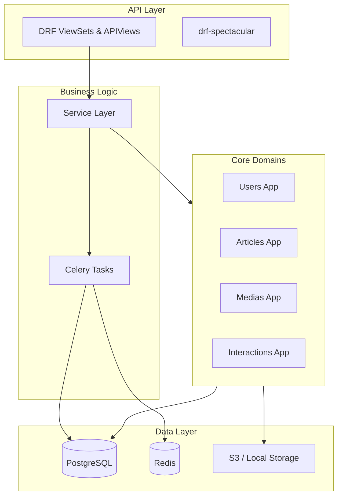

# Blog Platform — Enterprise-Grade Content Management System

## Project Overview
The **Blog Platform** is a production-ready, modular Django-based content management system designed for high-performance publishing workflows. It provides a robust backend for managing complex content lifecycles, user engagements, and centralized media assets with automated optimization.

### Purpose
To provide a scalable, secure, and developer-friendly foundation for modern blogs and news portals that require fine-grained access control, scheduled publishing, and rich media handling.

### Problem Solved
- **Content Lifecycle Management:** Handles the transition from draft to review, scheduled, and published states.
- **Media Management:** Manages uploaded media and integrates standard local or S3-compatible cloud storage backends.
- **Fragmented User Management:** Integrates standard JWT authentication with Google OAuth2 and Iranian-specific localized features (Jalali dates).
- **Scalability:** Built with a modular architecture that separates core concerns (Interactions, Navigation, Medias, Pages).

---

## Main Features

### 🔐 User & Identity Management
- **JWT Authentication:** Secure token-based access with refresh mechanisms.
- **Social Integration:** One-click login via Google OAuth2.
- **RBAC (Role-Based Access Control):** Predefined roles for Admins, Authors, and Users.
- **Profile Management:** Optimized profile pictures and biography tracking.

### ✍️ Advanced Publishing Engine
- **Rich Text Editing:** Integrated CKEditor 5 with image upload support.
- **Article Scheduling:** Automated publishing of scheduled content via Celery.
- **Versioning:** Historical revision tracking for all article edits.
- **Taxonomies:** Hierarchical categories, tags, and series management.

### 🖼️ Centralized Media Library
- **Automatic Optimization:** Real-time AVIF conversion and resizing for images.
- **Async Processing:** Background video optimization using FFmpeg.
- **Smart Linking:** Automatically syncs media attachments by parsing article content.

### 💬 Engagement & Interactions
- **Nested Comments:** Support for threaded discussions with moderation workflows.
- **Generic Reactions:** Extensible "Like" and Emoji system applicable to any content.

---

## Enterprise Caching Subsystem

The system features a production-grade, highly resilient **Enterprise Caching Subsystem** designed to handle high-traffic publisher environments with sub-5ms P95 latency.

### Core Architecture
- **Strict Abstraction**: No application code interacts directly with the Django/Redis cache layer. All reads/writes route through the central thread-safe `CacheManager` singleton (`cache_manager`).
- **Fail-Safe Fallback**: If Redis becomes offline or unreachable, the subsystem automatically and transparently falls back to local memory and PostgreSQL. Application requests never fail due to caching engine crashes.
- **Cache-Aside & Stale-While-Revalidate (SWR)**: High-traffic endpoints serve cached data instantly. If a cached value is *soft-expired* but within its *hard TTL*, a non-blocking background thread revalidates the cache while the stale value is returned immediately.
- **Cache Stampede Protection**: A thread-safe, atomic `DistributedLock` ensures that during a cache miss, only *one* concurrent request rebuilds the cache from PostgreSQL, while others wait or gracefully bypass to the DB.

### Key Capabilities
1. **Multilayer Cache Policies**: Defines four operational Cache Levels (No Cache, Short Cache, Medium Cache, Long Cache) with added random jitter on TTLs to prevent cache expiration storms.
2. **Pluggable Serialization & Compression**: Serializes payloads using binary `MessagePack` (with fallback to `JSON`) and compresses them using `Zstandard` (with fallback to `Gzip`). Active size boundaries enforce automatic compression for payloads >2KB and reject payloads >5MB.
3. **Wildcard-Free Invalidation**: Prohibits expensive, blocking Redis `keys *` wildcard deletions. Instead, invalidation is completely tag-based, logical version-based, and dependency-graph-driven.
4. **Selective Async Warmup**: Background Celery workers immediately pre-build cache payloads for critical pages (e.g. Homepage, sitemaps, categories) upon database content mutations.
5. **Predictive Prefetch**: A background service periodically scans registered hot keys and preemptively refreshes them when close to soft-expiry.

### Monitoring & Telemetry
Three JSON telemetry endpoints are exposed:
- `/health/cache`: Validates Django cache backend read/write/delete capabilities.
- `/health/redis`: Measures live Redis ping latency, memory/CPU usage, client counts, and client fragmentation.
- `/health/cache-manager`: Tests serialization, compression, and locking, and yields cache hits/misses, hit rate ratios, and average lookup/rebuild durations.

---

## Enterprise Backup & Disaster Recovery (BDR) Subsystem

The platform features an advanced, zero-trust **Backup & Disaster Recovery (BDR) Subsystem** built for high-resilience and database safety under load.

### Core Architecture & Capabilities
- **Memory-Safe Streaming I/O**: Reads and processes database, media, and configuration backups in 64KB chunks. Plaintext files never leak to disk, and the streaming architecture ensures flat RAM usage (<5MB) even for infinite database sizes, preventing Out-of-Memory (OOM) failures.
- **Bilingual SRE Design**: Fully localized with bilingual logs (English and Persian) and clear console output for all management commands.
- **GFS (Grandfather-Father-Son) Retention**: Programmatically purges expired backups while maintaining 24 hourly, 7 daily, 4 weekly, and 12 monthly backups. The newest backup is unconditionally protected.
- **Ransomware Deleted Object Protection**: S3-compatible cloud storage and local storage media backups never delete files in the backup destination even if they are removed or modified in the source, preventing malicious deletion or encrypting attacks.
- **Encrypted Configurations**: Automatically backups and encrypts crucial configuration files (`.env`, `nginx.conf`, `docker-compose.yml`) using stream-based AES-256-GCM, with zero-secret logging.

### Security & Cryptography Design
- **Authenticated Encryption**: Uses **AES-256-GCM** with 100,000 iterations of PBKDF2 HMAC-SHA256 key derivation.
- **Replay Protection**: Cryptographically binds an 8-byte big-endian sequential block index as Additional Authenticated Data (AAD) for each block, rejecting any block-reordering, truncation, or tampering attempts.
- **Strict Environment Validation**: Restored env configurations are verified for valid UTF-8 compatibility and `KEY=VALUE` environment syntax before applying.

### 8-Step Disaster Recovery Restore Workflow
Restoration is executed via `python manage.py restore_system` following a strict 8-step safety flow:
1. **Maintenance Mode Activation**: Sets an atomic cache lock to globally block write traffic.
2. **Restore Environment Verification**: Validates file permissions and paths.
3. **Active Connection Termination**: For PostgreSQL, issues `pg_terminate_backend` on active sessions to avoid locking deadlocks.
4. **Integrity & Decrypt Validation**: Performs a dry-run decryption/decompression check before writing anything.
5. **Safe Schema Reconstruction**: Drops and recreates the `public` schema (on Postgres) to avoid clashing duplicate keys or constraint errors.
6. **Schema Migration & Validation**: Runs `django-admin migrate` to ensure schema consistency.
7. **SRE Health Checks**: Runs queries on core models to ensure database reachability.
8. **Resume App Traffic**: Clears cache locks, resuming live write traffic.

---

## Technology Stack

| Component | Technology |
| :--- | :--- |
| **Backend** | Django 5.0.6 (Python 3.12) |
| **API Framework** | Django REST Framework (DRF) |
| **Database** | PostgreSQL 14 |
| **Task Queue** | Celery + Redis |
| **Real-time** | Django Channels (ASGI) |
| **Reverse Proxy** | Nginx |
| **Containerization** | Docker + Docker Compose |
| **Admin UI** | Unfold (Modern Django Admin) |
| **Documentation** | drf-spectacular (OpenAPI 3.0) |

---

## Architecture Summary
The system follows a **Modular Monolith** architecture. Each domain (Users, Articles, Medias, etc.) is isolated into its own Django application with dedicated models, services, and APIs.



### Service Boundaries
- `users`: Identity, Authentication, and Permissions.
- `articles`: Content engine, Taxonomies, and Revisions.
- `medias`: Centralized asset storage and processing.
- `interactions`: Social features (Comments, Reactions).
- `navigation` & `pages`: CMS structural components.

---

## Quick Start

### Requirements
- Docker and Docker Compose
- Python 3.12+ (for local development)
- PostgreSQL & Redis (for local development)

### Docker Setup (Recommended)
1. **Clone & Configure:**
   ```bash
   cp .env.example .env
   # Edit .env with your credentials (ensure STATIC_API_KEY is set)
   ```
2. **Build & Launch:**
   ```bash
   docker-compose up --build
   ```
3. **Initialize:**
   ```bash
   docker-compose exec web python manage.py migrate
   docker-compose exec web python manage.py createsuperuser
   ```

### Local Installation
1. **Install Dependencies:**
   ```bash
   pip install -r requirements.txt
   ```
2. **Run Migrations:**
   ```bash
   python manage.py migrate
   ```
3. **Start Server:**
   ```bash
   python manage.py runserver
   ```

---

## API & Documentation
The API follows RESTful principles with standardized JSON responses:
```json
{
  "data": { ... },
  "messagesList": [],
  "pagination": { ... }
}
```

- **Swagger UI:** `/api/schema/swagger-ui/`
- **Redoc:** `/api/schema/redoc/`
- **OpenAPI Spec:** `/api/schema/`

---

## Testing
Run the full test suite (Unit + Integration):
```bash
python manage.py test
```
Target coverage: **95%+**
