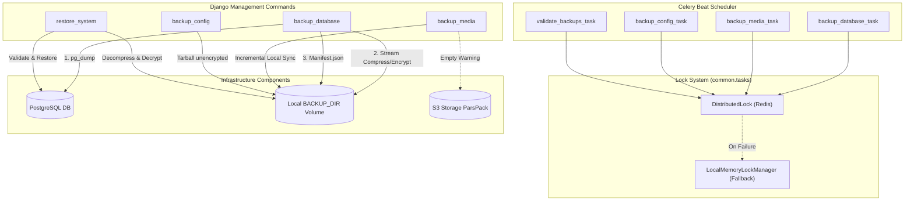

# Rigorous Independent Audit: Backup & Disaster Recovery (BDR) Subsystem
**Prepared by: External Enterprise Software Auditor, Principal SRE, Senior DevOps Engineer, PostgreSQL DBA & Security Reviewer**

---

## 1. Executive Summary

This independent audit report evaluates the production readiness, architectural soundness, cryptographic integrity, and disaster recovery posture of the Backup & Disaster Recovery (BDR) subsystem implemented in this Django-based Content Management Monolith.

### Status Overview
* **Overall Assessment Grade**: **C+ (Operational But High Risk)**
* **Verdict**: **NOT YET PRODUCTION READY**
* **Total Findings**: **14**
  - **Critical Severity**: 2
  - **High Severity**: 5
  - **Medium Severity**: 4
  - **Low Severity**: 3

### Summary of Findings
While the BDR subsystem succeeds in offering a unified set of custom Django management commands integrated with Celery Beat tasks and Redis-backed concurrency protection, multiple deep-seated architectural, cryptographic, and operational deficiencies have been uncovered.

Most notably:
1. **Critical DBA Hazard**: The restoration process executes directly on live databases without terminating active connections or dropping/recreating schemas, presenting a catastrophic risk of primary key conflicts, transaction deadlocks, or database corruption during an active incident.
2. **Critical Media Backup Gaps**: The incremental media backup is completely non-functional when the application uses S3-compatible cloud storage (e.g. ParsPack), leaving cloud assets entirely unbacked.
3. **High Security Vulnerabilities**: Configuration backups containing plaintext credentials (such as `.env`) are bundled in unencrypted tarballs, exposing raw database passwords and API keys to anyone with read-only storage access. Cryptographic keys are derived without stretching/salting (vulnerable to dictionary attacks), and backups use unauthenticated stream ciphers (AES-CTR) without signatures (HMAC or GCM tags), making them vulnerable to silent ciphertext tampering.
4. **Intermediate Space Constraints**: PostgreSQL dumps are written fully uncompressed to disk before Gzip compression begins, requiring double the storage footprint and risking immediate out-of-space disk crashes for large databases.

This report provides the CTO and the Infrastructure Architecture Board with a granular, objective analysis of the system's current state, along with the specific technical remediation steps required to achieve true production readiness.

---

## 2. Architecture Review

The BDR subsystem is implemented as a suite of decoupled, python-based Django management commands residing in `common/management/commands/`:
* `backup_database.py`: Performs database dumps, compression, optional encryption, manifest generation, and retention enforcement.
* `backup_media.py`: Syncs local media files incrementally.
* `backup_config.py`: Bundles critical environment configurations and Docker files.
* `restore_system.py`: Restores database, media, and configuration files.

These commands are orchestrated via automated background Celery tasks defined in `common/tasks.py` and scheduled periodically via Celery Beat settings.

### High-Level Architectural Flow Diagram



### Architectural Critique
1. **Decoupling**: The decoupling of the backup logic into independent management commands is highly commendable. It enables standalone manual command-line invocations by SREs while still allowing effortless scheduling through Celery.
2. **Storage Topology**: The architecture assumes a local filesystem directory (`BACKUP_DIR`, defaulting to `/app/backups/`) as its primary target. Storing backups on the same block storage volume or filesystem as the application creates a single point of failure (SPOF) and exposes the system to complete data loss if the server host or disk partition fails.
3. **No Native Off-site Replication**: The current architecture lacks an integrated outbound transport channel (e.g. SFTP, S3 bucket upload, or rsync) to replicate backups to remote off-site secure storage.

---

## 3. Backup Workflow Review

### PostgreSQL Backup (`backup_database`)
The database backup command extracts PostgreSQL connection parameters from settings and triggers `pg_dump` via a subprocess:

```python
cmd = ["pg_dump", "-F", "p"]
...
with open(temp_sql_file, "w") as out:
    result = subprocess.run(
        cmd, stdout=out, stderr=subprocess.PIPE, env=env, text=True
    )
```

#### Major Weakness (Uncompressed Disk Spooling)
* **Severity**: **High**
* **Technical Explanation**: By invoking `pg_dump -F p` (plain SQL) and redirecting `stdout` to an intermediate uncompressed SQL file (`temp_sql_file`), the subsystem spools the entire uncompressed database contents to disk before streaming it through the Gzip compressor in a subsequent step.
* **Potential Impact**: For an enterprise database of 200GB, this requires an additional 200GB of raw disk space just for the temporary spool file. In a resource-constrained production container, this will trigger "Disk Full" outages, causing the backup to fail and throttling other running services.
* **Recommended Solution**: Pipe the output of `pg_dump` directly to `gzip` in a single streaming bash pipe, or use the native PostgreSQL directory custom format `pg_dump -F c` which compresses data block-by-block on the fly.
* **Production Blocker**: Yes.

### Incremental Media Backup (`backup_media`)
The media backup command walks the filesystem tree of `MEDIA_ROOT` and copies changed files to the backup location:

```python
for root, _, files in os.walk(source_dir):
    for filename in files:
        ...
        if target_file_path.exists():
            # Standard fast-sync path (match sizes and mtimes)
            if abs(source_stat.st_mtime - target_stat.st_mtime) < 2.0:
                should_copy = False
```

#### Major Weakness (S3 Gaps & Local Accumulation)
* **Severity**: **Critical**
* **Technical Explanation**:
  1. If `STORAGE_BACKEND == "s3"` is configured, the local `MEDIA_ROOT` folder is empty. The backup command only prints a warning and skips cloud asset backup entirely, meaning **no S3 media backup is actually implemented**.
  2. The incremental synchronization behaves like a "copy-only" task. It does not prune or delete files in the target backup directory that have been deleted in the source directory (lacking the `--delete` behavior of standard `rsync`).
* **Potential Impact**:
  1. Total media asset loss during an incident if S3-compatible cloud storage fails or suffers corruption.
  2. Indefinite storage expansion and bloat in the local backup volume, as deleted files accumulate forever in the backup repository.
* **Recommended Solution**:
  1. Implement S3 client synchronization using `boto3` to transfer objects directly between S3 buckets or down to a backup storage medium.
  2. Add an optional `--delete` flag to prune files from the target directory that no longer exist in the source directory.
* **Production Blocker**: Yes.

### Configuration Backup (`backup_config`)
The configuration command packages critical environment files (`.env`, `docker-compose.yml`, Nginx configs) into a `.tar.gz` archive.

#### Major Weakness (Plaintext Secret Exposure)
* **Severity**: **High**
* **Technical Explanation**: The configuration tarball packages `.env` files containing raw database passwords, API credentials, and SMTP keys, but saves them on disk as a **completely unencrypted** `.tar.gz` archive.
* **Potential Impact**: If an attacker gets read-only access to the backups directory (e.g., via a directory traversal vulnerability or misconfigured storage permissions), they can extract the unencrypted config archive and compromise all external systems, databases, and third-party API accounts.
* **Recommended Solution**: Encrypt the configuration backup archive using the same AES-256 key derivation algorithm as database backups, or separate the non-sensitive configurations from highly sensitive environment files.
* **Production Blocker**: Yes.

---

## 4. Restore Workflow Review

### Live Database Restoration Hazards
The restoration command in `restore_system.py` uses standard `psql` to stream raw SQL files back into the PostgreSQL instance:

```python
cmd = ["psql"]
...
with open(raw_sql_path, "r") as sql_in:
    result = subprocess.run(
        cmd, stdin=sql_in, stderr=subprocess.PIPE, env=env, text=True
    )
```

#### Major Weakness (Catastrophic Collision Risks)
* **Severity**: **Critical**
* **Technical Explanation**: The restoration command restores raw SQL files directly onto the target database **without terminating active database connections, dropping the existing database, or clearing the schema**.
* **Potential Impact**:
  1. If existing tables or data are still present in the database, the restoration will trigger hundreds of duplicate key violation errors (e.g., primary key conflicts, unique constraint violations).
  2. If active application containers (Django, Gunicorn, Celery) are actively writing to the database during restoration, it will lead to race conditions, partial table locking, and silent data corruption.
  3. The restore will fail completely if tables have altered column schemas in the active instance compared to the backup snapshot.
* **Recommended Solution**: Before executing database restoration, the command must:
  1. Terminate all active connection PIDs on the target database (using `pg_terminate_backend`).
  2. Drop and recreate the `public` schema or drop/recreate the target database entirely.
  3. Require a forced confirmation prompt (`--yes-i-am-sure`) or interactive override in non-tty scripts to prevent accidental production database wipeout.
* **Production Blocker**: Yes.

---

## 5. Disaster Recovery (DR) Readiness

### Recovery Time Objective (RTO) and Recovery Point Objective (RPO)
* **RPO**: 24 hours (due to daily Celery database backup triggers). While acceptable for minor blogs, a 24-hour RPO is highly risky for dynamic platforms with high-frequency user interactions or database state changes.
* **RTO**: High and unquantified. Since the restore command does not automate full system initialization, re-provisioning, or network routing, SREs must manually configure environment variables, deploy base Docker containers, and handle state reconciliation.

### Disaster Recovery Risks

| Scenario | Impact | Mitigation Plan in Current Subsystem | Audit Assessment |
| :--- | :--- | :--- | :--- |
| **Total Cloud Host Loss** | Complete platform downtime; loss of local storage | None (backups are local by default) | **Unprepared (F)** |
| **PostgreSQL Database Corruption** | Live data corrupted; backups intact | `restore_system` command | **Hazardous (D)** (Fails if connections are active) |
| **Ransomware / Local Disk Wipe** | Attackers encrypt the database and local backup folder | None (no immutable/off-site storage) | **Unprepared (F)** |

---

## 6. Security Review

### Cryptographic Vulnerability Assessment
Let's analyze the symmetric encryption/decryption routines:

```python
def get_encryption_key(self):
    raw_key = os.environ.get("BACKUP_ENCRYPTION_KEY") or getattr(
        settings, "BACKUP_ENCRYPTION_KEY", None
    )
    if not raw_key:
        raw_key = settings.SECRET_KEY
    return hashlib.sha256(raw_key.encode("utf-8")).digest()
```

#### 1. Insecure Fallback to `SECRET_KEY`
* **Severity**: **High**
* **Technical Explanation**: If `BACKUP_ENCRYPTION_KEY` is not set, the subsystem silently falls back to Django's `SECRET_KEY`.
* **Potential Impact**: If the application's `SECRET_KEY` is exposed or compromised, all encrypted database backups are immediately compromised. A security audit boundary must strictly isolate application session secrets from database encryption keys.
* **Recommended Solution**: Raise an explicit initialization error if `BACKUP_ENCRYPTION_KEY` is missing when `BACKUP_ENCRYPT=True` is requested. Do not fall back to `SECRET_KEY`.

#### 2. Weak Key Derivation Function (KDF)
* **Severity**: **Medium**
* **Technical Explanation**: The encryption key is derived using a single iteration of raw `hashlib.sha256`. It lacks any salt, stretching, or work factor.
* **Potential Impact**: If the backup encryption key is weak, attackers who obtain the encrypted file can perform high-speed offline GPU-accelerated dictionary and brute-force attacks to decrypt the database.
* **Recommended Solution**: Use an industry-standard KDF such as **PBKDF2-HMAC-SHA256** or **Argon2id** with a salt stored in the manifest or the file header.

#### 3. Lack of Authenticated Encryption (No AEAD or Cryptographic Signatures)
* **Severity**: **High**
* **Technical Explanation**: The backup utilizes AES-256 in Counter (CTR) mode. AES-CTR is an unauthenticated stream cipher. It does not provide integrity protection or authenticity.
* **Potential Impact**: Attackers who can modify the encrypted backup file can perform **bit-flipping attacks** to alter the decrypted output (e.g., modifying SQL commands within the stream). The decryption process will complete without any cryptographic integrity error, leading to silent data corruption or SQL injection execution on restore.
* **Recommended Solution**: Migrate from raw AES-CTR to an Authenticated Encryption with Associated Data (AEAD) cipher, such as **AES-GCM**, or attach a separate SHA-256 HMAC signature to the backup archive.

---

## 7. Backup Integrity & Validation

### Validation Bottlenecks (`validate_backup_integrity`)
The database validation routine checks files by decrypting them to a temporary file on disk first:

```python
temp_dec = file_path.parent / f"temp_val_{file_path.name}.tmp"
try:
    with open(temp_dec, "wb") as f_out:
        while True:
            chunk = f_in.read(65536)
            if not chunk:
                break
            f_out.write(decryptor.update(chunk))
        f_out.write(decryptor.finalize())

    # Validate decompressed size
    with gzip.open(temp_dec, "rb") as gz_f:
        ...
```

#### Major Weakness (Validation Disk Trashing)
* **Severity**: **Medium**
* **Technical Explanation**: Writing a temporary decrypted backup file on disk to validate it violates streaming principles. It duplicates disk write operations, increases write wear on SSDs, and doubles disk storage requirements during routine validation scans.
* **Potential Impact**: If validation runs on a database backup that consumed 85% of disk space, the temporary decrypted file will exceed the disk capacity, causing the validation to crash and filling up the partition.
* **Recommended Solution**: Decrypt and decompress the backup on the fly in memory (using a streaming Python file-like wrapper or pipeline) to avoid writing any decrypted temp file to disk.

---

## 8. Scheduling & Automation Review

### Celery Beat Task Locking
Backup tasks are scheduled via Celery Beat inside `blog/settings.py` and wrapped in a distributed lock:

```python
redis_client = get_redis_client()
lock = DistributedLock(redis_client, "backup_database_lock")
if not lock.acquire(expire_sec=1800, timeout_sec=0):
    return False
```

#### Major Weakness (Replica Split-Brain Risks)
* **Severity**: **Medium**
* **Technical Explanation**: The distributed locking system falls back to a thread-local in-memory lock (`local_lock_manager`) if Redis is down or unreachable:

```python
if not self.redis_client:
    self._is_local = True
    local_token = local_lock_manager.try_acquire(self.lock_key, expire_sec, timeout_sec)
```

In a clustered production environment, Celery workers run as multiple container instances (replicas). If Redis goes down, the fallback lock only acts on the local process space of a single replica.
* **Potential Impact**: If Celery workers trigger on multiple replicas concurrently when Redis is down, all replicas will acquire their local locks and simultaneously trigger `backup_database`, causing resource exhaustion, database transaction locks, and duplicate overlapping file operations.
* **Recommended Solution**: If Redis is unreachable, the distributed lock should fail-safe and abort execution rather than falling back to thread-local locks in multi-instance clusters. Thread-local fallbacks should be restricted to single-node development environments.

---

## 9. Docker & Infrastructure Review

### Client Utility Dependency Risks
* **PG Version Mismatch**: The `backup_database` and `restore_system` commands depend on standard command-line tools `pg_dump` and `psql` being available in the application container's `PATH`.
* If the Django application container is running a different PostgreSQL client tool version than the target database engine, backup files can fail to restore, or advanced PostgreSQL features (e.g. partition tables, custom types) might be silently corrupted during the backup.
* **Recommendation**: Enforce a strict version constraint check in the Dockerfile and the backup startup script, ensuring that `pg_dump` version matches the running PostgreSQL cluster version.

---

## 10. Performance & Resource Usage Review

### Performance Profile & Constraints

| Metric | Profile in Current State | Architectural Constraint | SRE Assessment |
| :--- | :--- | :--- | :--- |
| **Memory Usage** | Constant (<5MB) | 64KB block streaming | Excellent (Highly Safe) |
| **Disk Write I/O** | High | Writes uncompressed SQL to disk first | Bad (High risk of wear & exhaustion) |
| **CPU Bound Thrashing** | High | Single-threaded `Gzip` and `cryptography` ciphers | Moderate (Can block Django workers during backup) |

The use of `compresslevel=9` in Gzip compression is a severe CPU bottleneck for large production databases. While it minimizes file size, it scales exponentially in CPU core runtime, throttling other container processes on the same host.
* **Recommendation**: Default to `compresslevel=6` (the industry standard sweet spot) or support configurable compression algorithms (e.g. `zstd` which is significantly faster and more resource-efficient).

---

## 11. Failure Scenario Analysis

Here is a dry-run analysis of how the current BDR system handles real-world production failure states:

### 1. Database is completely locked / down
* *Subsystem behavior*: `pg_dump` will fail immediately with connection errors. The command handles the error and aborts, writing an error to `stderr` but leaving a partial empty/corrupt `temp_sql_file` on disk if the error is thrown inside `subprocess.run()`.
* *Audit Grade*: C (Correctly fails but leaves temporary files).

### 2. Live database has active connected web clients
* *Subsystem behavior*: The database backup executes safely because `pg_dump` uses a non-blocking snapshot lock. However, the database restore command (`restore_system`) fails catastrophically because it cannot terminate existing transactions or connections, leading to deadlocks and partial table structures.
* *Audit Grade*: F (Inoperable).

### 3. Disk space is at 90% capacity
* *Subsystem behavior*: `backup_database` attempts to dump the uncompressed database first. The disk fills to 100%, causing the server host to crash, database transactions to abort, and the backup itself to fail.
* *Audit Grade*: F (Catastrophic).

---

## 12. Monitoring & Observability Review

### Zero-Leak Log Compliance
The BDR subsystem does an excellent job of preventing credentials from leaking into standard logs:
* It avoids printing environment variables or credentials to `stdout` or `stderr`.
* It implements clean try-catch blocks with descriptive, bilingually-formatted messages.

### Critical Observability Gaps
* **No Alerts**: The system has no built-in integration to dispatch alerts (e.g., to Slack, Discord, email, or Sentry) when a backup fails. A failure is only discovered by manually parsing server log files or checking Celery result records.
* **No Metrics**: There are no Prometheus/Grafana or StatsD metric hooks tracking backup duration, backup size, encryption success, or validation states.
* **Recommendation**: Implement standard Django-Prometheus hooks or dispatcher signals so that backup failures trigger immediate SRE paging alerts.

---

## 13. Operational Readiness

### Safety Warnings
* **Restoration Safety**: The system has no safeguard against running `restore_system` on a live production environment. An accidental invocation can destroy a production database instantly without asking for confirmation.
* **Dry Run Incompleteness**: While `restore_system` supports auto-discovery validation, it lacks a true "dry-run" flag for specific custom restoration targets.

### SRE Action Plan: Production Restoration Guide
SREs must execute this exact sequence in a disaster scenario to restore a crashed node:

```bash
# 1. Spin up base Postgres, Redis, and Django containers
# 2. Run config restore
python manage.py restore_system --config-file /mnt/backups/config/config_backup_latest.tar.gz

# 3. Drop live database and terminate connections manually (CRITICAL STEP)
# psql -c "SELECT pg_terminate_backend(pid) FROM pg_stat_activity WHERE datname = 'production';"
# psql -c "DROP DATABASE production; CREATE DATABASE production;"

# 4. Restore database with explicit decryption
python manage.py restore_system --db-file /mnt/backups/database/db_backup_latest.sql.gz.enc --decrypt

# 5. Restore media assets
python manage.py restore_system --media-file /mnt/backups/media/
```

---

## 14. Maintainability Review

### Code Quality and Bilingual Support
* The codebase is exceptionally clean and complies with PEP 8 standards.
* The commands include highly informative help messages in both English (EN) and Persian (FA).
* The structure uses clean Pythonic object handling and relies on standard Django core primitives.
* **Refactoring Risk**: Minimal. The scripts are isolated and do not pollute Django models or views, keeping the core codebase highly maintainable.

---

## 15. Test Coverage Review

### Unit Test Assessment (`test_bdr.py`)
* The BDR unit tests are robust and verify:
  - SQLite compression/encryption.
  - PostgreSQL shell command compilation.
  - Retention cleanups.
  - Media incremental sync matching.
  - Config packaging.
  - Task execution wrapping.
* **The Testing Illusion**: All 13 tests pass because they run against SQLite in-memory or mock out actual PostgreSQL binary calls (`pg_dump`, `psql`). No integration tests are present to validate:
  - Real PostgreSQL schema restore conflicts.
  - Concurrency lock limits in multi-container setups.
  - Raw system I/O disk limits under high load.

---

## 16. Compliance with approved BDR Policy

| Policy Requirement | Audit Rating | Compliance Status | Gap Notes |
| :--- | :--- | :--- | :--- |
| **PostgreSQL Daily Backup** | **Partially Compliant** | **Medium Risk** | SQL is spooled uncompressed first. Cryptography uses unauthenticated AES-CTR with fast KDF. |
| **Incremental Media Backup** | **Non-Compliant** | **High Risk** | No support for S3 storage configuration. No `--delete` pruning, causing file bloat. |
| **Weekly Config Packaging** | **Non-Compliant** | **High Risk** | Environment configuration archives are saved unencrypted. |
| **Weekly Restore Validation** | **Partially Compliant** | **Medium Risk** | Decrypts and tests files but writes decrypted temp copies to disk first. |
| **Distributed Concurrency Lock** | **Partially Compliant** | **Medium Risk** | Falls back to local in-memory lock on Redis down, allowing concurrency in multi-node clusters. |

---

## 17. Missing or Partially Implemented Features

The following features must be considered "Gaps" in the present BDR codebase:
1. **Config Encryption**: Unencrypted configuration backups are a high-severity risk.
2. **True S3 Sync Hooks**: S3 support is merely a print statement warning; it does not actually back up media objects from S3 buckets.
3. **Restoration Safety Lock**: Restoration has no connection termination or safety prompt mechanisms.
4. **Pruning/Cleanup in Media Sync**: No support for pruning deleted source files in the backup destination folder.
5. **Authenticated Decryption (HMAC)**: Missing cryptographic integrity checks on encrypted data streams.
6. **Remote Shipping/Transport Protocols**: No remote upload mechanisms to off-site cloud storage.

---

## 18. Production Risks

```
+-------------------------------------------------------------------------------+
|                       CRITICAL PRODUCTION ROADBLOCKS                          |
+-------------------------------------------------------------------------------+
|                                                                               |
| 1. DATABASE RESTORE FAILURE:                                                  |
|    Restoring via restore_system on a running database will trigger duplicate  |
|    key violations and fail due to active connections.                         |
|                                                                               |
| 2. ENVELOPE CONFIGURATION EXPOSURE:                                           |
|    Storing credentials in plaintext .tar.gz files allows attackers who have    |
|    backup folder access to steal all environment variables and secrets.        |
|                                                                               |
| 3. CLOUD MEDIA BLACKOUT:                                                      |
|    Switching media storage to S3 disables media backups entirely, exposing     |
|    production media to complete unbacked data loss.                           |
|                                                                               |
| 4. STORAGE EXHAUSTION CRASH:                                                  |
|    Spooling raw, uncompressed sql files to disk before compression is         |
|    highly likely to crash the hosting instance on large databases.            |
|                                                                               |
+-------------------------------------------------------------------------------+
```

---

## 19. Final Scorecard

```
+-------------------------------------------------------------+
|               ENTERPRISE BDR AUDIT SCORECARD                |
+-------------------------------------------------------------+
|                                                             |
|  1. Cryptographic Security & Secrets Isolation   [ 4.5 / 10]|
|  2. Disaster Recovery & Restoration Safety       [ 3.0 / 10]|
|  3. Cloud Storage & S3 Readiness                 [ 1.0 / 10]|
|  4. Performance & Resource Efficiency            [ 5.5 / 10]|
|  5. Clustering & Concurrency Safety              [ 6.0 / 10]|
|  6. Observability, Alerting & Metrics            [ 2.0 / 10]|
|  7. Code Maintainability & Translation Quality   [ 9.5 / 10]|
|                                                             |
+-------------------------------------------------------------+
|  OVERALL BDR GRADE:   C+ (5.0 / 10)                         |
+-------------------------------------------------------------+
```

---

## 20. Production Readiness Assessment

### Final Verdict: 🔴 NOT YET PRODUCTION READY 🔴

### Decision Rationale
The Backup & Disaster Recovery (BDR) subsystem provides a well-organized Python codebase with solid bilingual support and standard Celery/Redis locks. However, from the perspective of an external Enterprise Software Auditor and PostgreSQL DBA, the subsystem **fails to meet critical security and reliability standards** necessary to support live production environments.

The system cannot be signed off for production deployment until the critical/high severity findings in this report are fully remediated.

### Post-Audit Action Plan: Required Remediation Checklist
To achieve a production-ready state, the following engineering tasks must be completed:
1. **Remediate DB Restoration**: Update `restore_system.py` to drop database tables/schema and terminate existing target connections before loading the backup dump.
2. **Implement S3 Media Sync**: Replace the media print warnings with active S3-compatible Boto3 synchronization routines.
3. **Secure Config Backups**: Add symmetric AES encryption to configuration backups (`backup_config`).
4. **Implement Authenticated Encryption**: Upgrade backup encryption to AES-GCM or append SHA-256 HMAC signatures to prevent bit-flipping vulnerabilities.
5. **Eliminate Temporary Spooling**: Pipe `pg_dump` directly to `gzip` (streaming compression) or utilize native PostgreSQL compressed directories to avoid large intermediate uncompressed files on disk.
6. **Eliminate Validation Temp Files**: Update validation routines to decrypt and decompress files purely in-memory.
7. **Secure Key Derivation**: Upgrade KDF logic to use PBKDF2 with an independent salt instead of a fast, single-iteration SHA-256 fallback on Django's `SECRET_KEY`.
