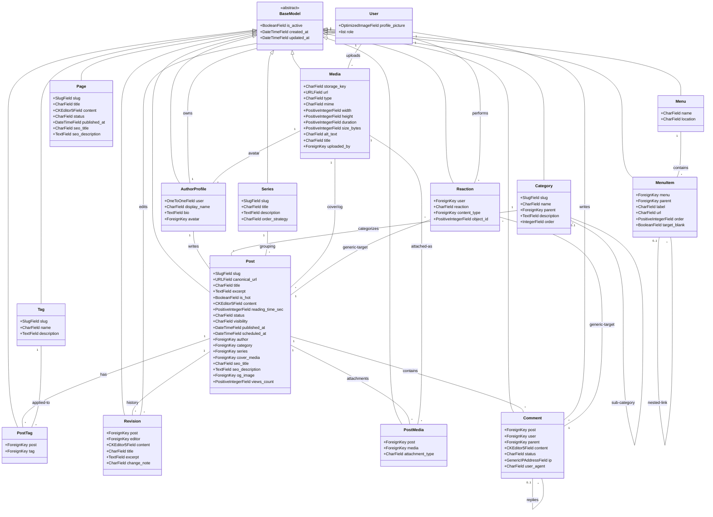
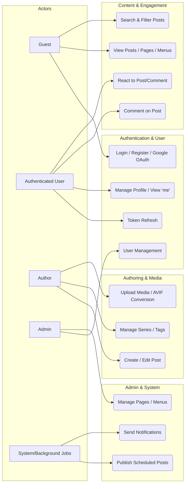
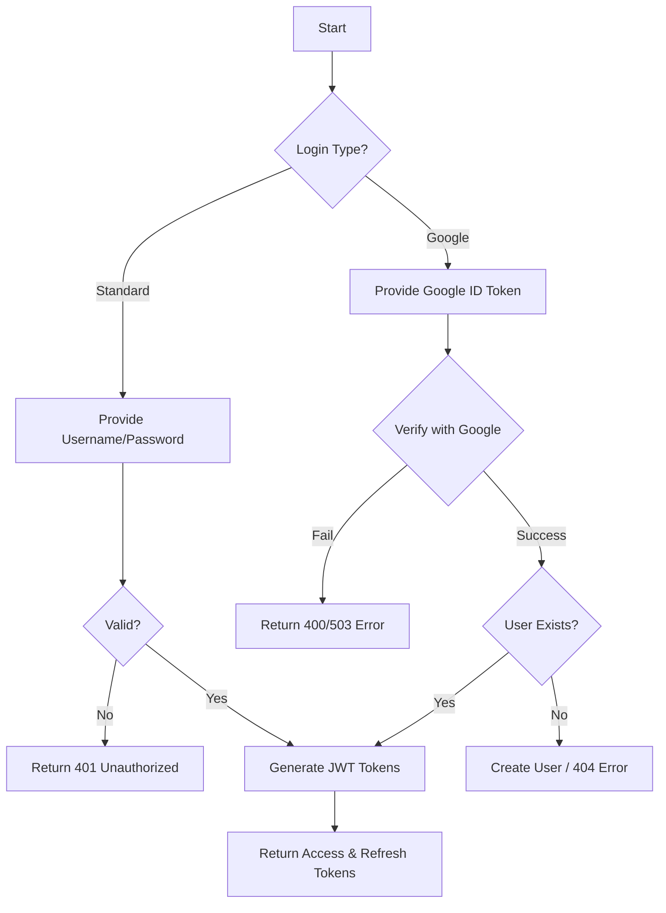
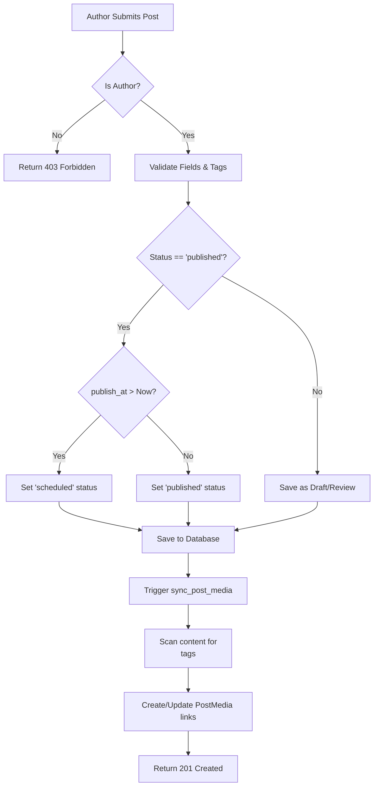
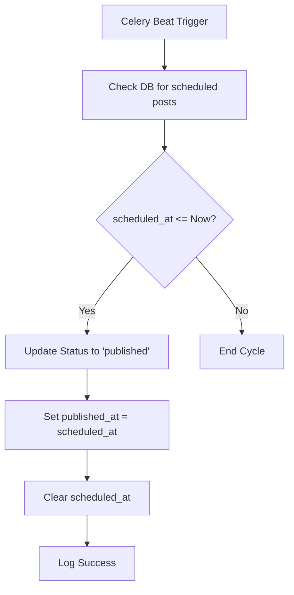
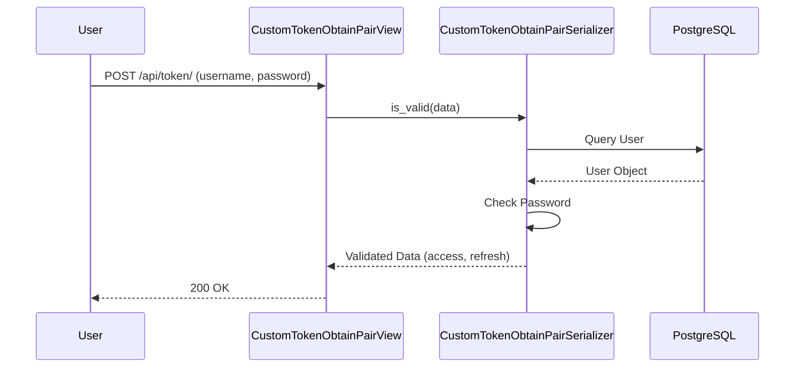
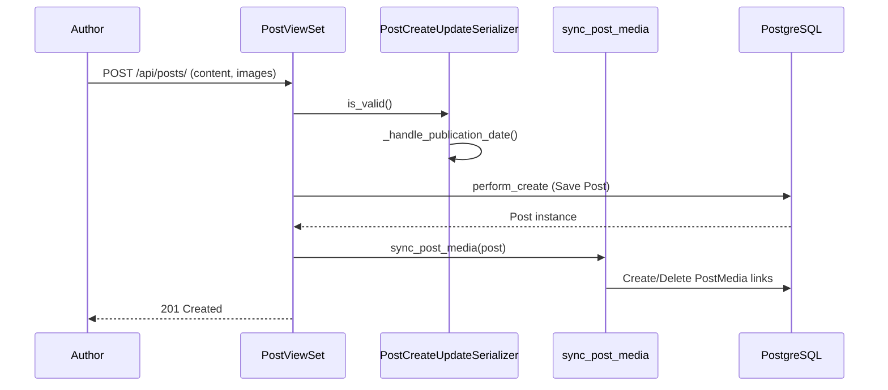
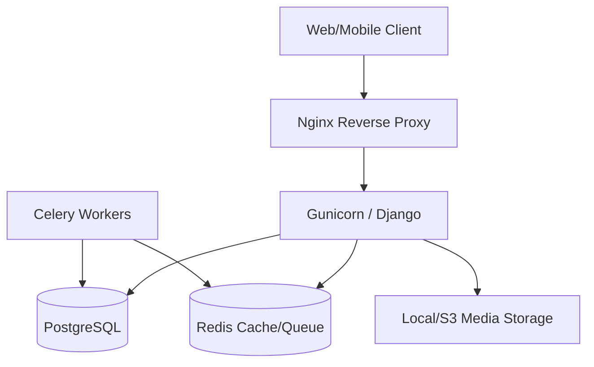
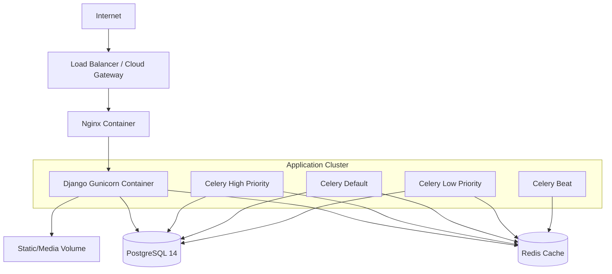

# System Audit & Design Report

This document provides a comprehensive professional-grade design documentation and audit of the Blog Platform, reverse-engineered from the Django/DRF implementation.

---

## SECTION 1 — CLASS DIAGRAM

---

## SECTION 2 — USE CASE DIAGRAM

---

## SECTION 3 — ACTIVITY DIAGRAMS

### 1. Login Flow (Standard & Google OAuth)

### 2. Post Creation Flow (with Media Sync)

### 3. Scheduled Publishing (Background)

---

## SECTION 4 — SEQUENCE DIAGRAMS

### 1. Authentication Flow (JWT)

### 2. Post Creation Flow

---

## SECTION 5 — SYSTEM DESIGN DOCUMENT (SDD)

### 1. System Overview
*   **Purpose:** A modern, scalable blog platform with Persian/Jalali support and optimized media management.
*   **Architecture Type:** Modular Monolith. The system is organized into distinct apps (Users, Posts, Medias, Interactions, Pages, Navigation) with a shared Core.

### 2. Architecture Diagram

### 3. Data Architecture
*   **Database:** PostgreSQL 14.
*   **ORM:** Django ORM with extensive use of `select_related` and `prefetch_related` for performance.
*   **Relationships:** Mix of standard Foreign Keys and Django ContentTypes (Generic Relations) for reactions.

### 4. API Architecture
*   **Structure:** Django REST Framework with ViewSets.
*   **Standardization:** Custom Renderers and Schemas ensure all responses follow the `{"data": ..., "messagesList": ...}` format.
*   **Authentication:** JWT (SimpleJWT) and Google OAuth2.

### 5. Security Architecture
*   **Permissions:** Multi-layered access control (`IsOwnerOrAdmin`, `IsAuthorOrAdminOrReadOnly`).
*   **Data Protection:** Django Axes for brute-force protection, input sanitization via CKEditor5 and file validation.

### 6. Scaling Strategy
*   **Horizontal Scaling:** Stateless Django application allows multiple Gunicorn instances.
*   **Caching:** Redis used for session management and distributed task brokering.
*   **Async Processing:** Celery handles high-latency tasks (Media processing, scheduled publishing, notifications).

---

## SECTION 6 — DEPLOYMENT DIAGRAM

---

## SECTION 7 — CONSISTENCY & AUDIT REPORT

### Issues Found
1.  **Legacy Code in Permissions:** The `users/permissions.py` file contains logic for 'Support Tickets', 'Tournament Reports', and 'Winner Submissions' which do not exist in the current project scope.
2.  **Redundant Permission Implementation:** There are two `IsOwnerOrReadOnly` classes (one in `users/permissions.py` and another in `common/permissions.py`) with slightly different implementations.
3.  **Missing Global Error Handling for Non-API Paths:** While API 404s are handled with JSON, other external paths redirect to a hardcoded URL which might not exist.

### Missing Documentation
1.  **Filter Logic Documentation:** The specific filtering capabilities of `PostFilter` are not fully documented in the code docstrings.
2.  **AVIF Conversion Side Effects:** The automatic conversion of all images to AVIF in `create_media_from_file` is a significant business rule not explicitly highlighted in the high-level README.

### Design Weaknesses
1.  **Synchronous Media Sync:** The `sync_post_media` service is called synchronously in `Post.save()`. For posts with many images, this could cause slow response times and potential timeouts.
2.  **Hardcoded Paths:** Some services (e.g., `increment_post_view_count`) use hardcoded error messages and logging strings rather than localized or standardized constants.

### Inconsistencies
*   **Permissions vs. Models:** The `IsOwnerOrAdmin` permission checks for a `ticket` attribute, but no Ticket model is present in the codebase.
*   **Serialization vs. Storage:** Images are stored as AVIF but the model fields are standard `OptimizedImageField`, leading to a potential discrepancy if the field logic expects standard formats (JPG/PNG).

### Audit Summary
The system is well-structured as a modular monolith with a clean separation of concerns. However, it carries significant "technical debt" in the form of legacy permission logic from a previous iteration of the project (likely a tournament management system). Cleaning up these legacy references and moving `sync_post_media` to an asynchronous Celery task would significantly improve maintainability and performance.
